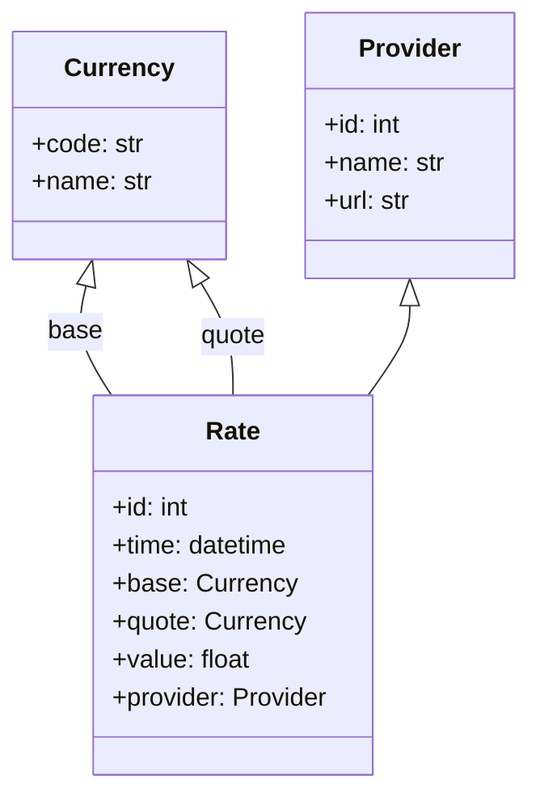

# Domain Model UML Diagram

This diagram represents the core entities and relationships for the Currency Rates App domain model.

```mermaid
classDiagram
    class Currency {
        +code: str
        +name: str
    }
    class Provider {
        +id: int
        +name: str
        +url: str
    }
    class Rate {
        +id: int
        +time: datetime
        +base: Currency
        +quote: Currency
        +value: float
        +provider: Provider
    }
    Currency <|-- Rate : base
    Currency <|-- Rate : quote
    Provider <|-- Rate
``` 